# Hospital Management System - UML Diagrams

## 1. Class Diagram - Domain Entities

## 2. Class Diagram - Repository Layer (Data Access)

```mermaid
classDiagram
    %% Repository Interfaces
    class IStaffRepository {
        <<interface>>
        +addStaff(staff) Future~void~
        +getStaffById(id) Future~Staff?~
        +getStaffByRole(role) Future~List~Staff~~
        +getAllStaff() Future~List~Staff~~
        +updateStaff(staff) Future~void~
        +deleteStaff(id) Future~bool~
    }
    
    class IPatientRepository {
        <<interface>>
        +addPatient(patient) Future~void~
        +getPatientById(id) Future~Patient?~
        +getAllPatients() Future~List~Patient~~
        +updatePatient(patient) Future~void~
        +deletePatient(id) Future~bool~
        +searchPatients(query) Future~List~Patient~~
    }
    
    class IRoomRepository {
        <<interface>>
        +addRoom(room) Future~void~
        +getRoomById(id) Future~Room?~
        +getRoomsByType(type) Future~List~Room~~
        +getAllRooms() Future~List~Room~~
        +updateRoom(room) Future~void~
        +getAvailableRooms() Future~List~Room~~
    }
    
    class IAppointmentRepository {
        <<interface>>
        +scheduleAppointment(appointment) Future~void~
        +getAppointmentById(id) Future~Appointment?~
        +getAppointmentsByPatient(patientId) Future~List~Appointment~~
        +getAppointmentsByDoctor(doctorId) Future~List~Appointment~~
        +getUpcomingAppointments() Future~List~Appointment~~
        +getAppointmentsByDate(date) Future~List~Appointment~~
        +updateAppointment(appointment) Future~void~
        +cancelAppointment(id) Future~bool~
    }
    
    class IPrescriptionRepository {
        <<interface>>
        +addPrescription(prescription) Future~void~
        +getPrescriptionById(id) Future~Prescription?~
        +getPrescriptionsByPatient(patientId) Future~List~Prescription~~
        +getActivePrescriptions(patientId) Future~List~Prescription~~
        +updatePrescription(prescription) Future~void~
        +getPrescriptionsByDoctor(doctorId) Future~List~Prescription~~
    }
    
    %% Concrete Implementations
    class StaffRepository {
        -Map~String, Staff~ staffStorage
        -String filePath
        -bool isLoaded
        -loadData() Future~void~
        -ensureLoaded() Future~void~
        -fromJson(json) Staff
        -saveData() Future~void~
    }
    
    class PatientRepository {
        -Map~String, Patient~ patientStorage
        -String filePath
        -loadData() Future~void~
        -saveData() Future~void~
    }
    
    class RoomRepository {
        -Map~String, Room~ roomStorage
        -String filePath
        -loadData() Future~void~
        -saveData() Future~void~
    }
    
    class AppointmentRepository {
        -Map~String, Appointment~ appointmentStorage
        -String filePath
        -loadData() Future~void~
        -saveData() Future~void~
    }
    
    class PrescriptionRepository {
        -Map~String, Prescription~ prescriptionStorage
        -String filePath
        -loadData() Future~void~
        -saveData() Future~void~
    }
    
    IStaffRepository <|.. StaffRepository
    IPatientRepository <|.. PatientRepository
    IRoomRepository <|.. RoomRepository
    IAppointmentRepository <|.. AppointmentRepository
    IPrescriptionRepository <|.. PrescriptionRepository
```

## 3. Class Diagram - Service Layer (Business Logic)

## 4. Class Diagram - UI Layer

## 5. Architecture Diagram - Layered Architecture

## 6. Sequence Diagram - Schedule Appointment Flow

## 7. Sequence Diagram - View All Doctors Flow

## 8. Use Case Diagram

## 9. Component Diagram

## 10. State Diagram - Appointment Lifecycle

## 11. State Diagram - Bed Status Lifecycle

## 12. Deployment Diagram

